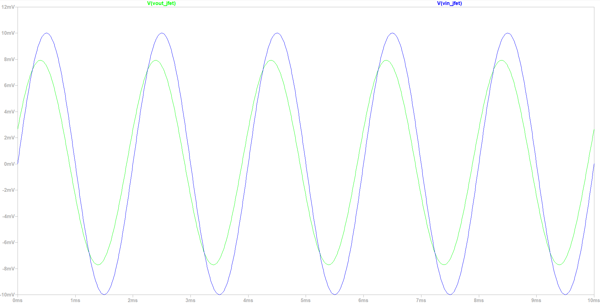
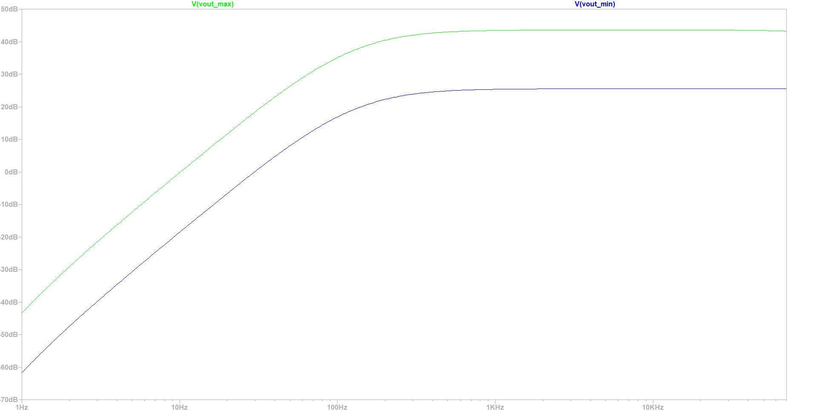
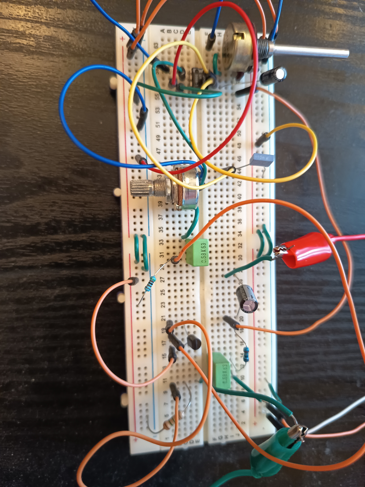

# LM386 JFET Guitar Amplifier

This repository documents a small **LM386-based guitar amplifier** with a **BF245C JFET input buffer**. The project includes the LTspice simulation, a discrete breadboard implementation, screenshots of the main simulation results, and a short performance video. 

[Performance video on Google Drive](https://drive.google.com/file/d/1cy1pMBwWEGLlc1JcR0GqombH3291XYgJ/view?usp=sharing)

## Repository Tree

```text
.
├── README.md
├── LM386_Guitar_Amp.asc
├── LM386.sub
├── images/
│   ├── schematic.png
│   ├── breadboard_closeup.jpg
│   ├── test_setup.jpg
│   ├── jfet_buffer_transient.png
│   └── gain_response_ac.png
```

## Reference Design

External reference used for the original circuit:

[ElectroSmash Ruby Amp Analysis](https://electrosmash.mas-effects.com/ElectroSmash%20-%20Ruby%20Amp%20Analysis.pdf)

## Schematic and Circuit Operation


The amplifier has three main sections:

1. **Input / JFET buffer stage**  
   The guitar signal enters through the input coupling capacitor and is applied to the gate of a BF245C JFET. The JFET is connected as a source follower, so it provides high input impedance and drives the following volume network.

2. **Volume and coupling network**  
   The buffered signal passes through a coupling capacitor and then into a 22 kΩ volume potentiometer model. This forms one of the high-pass sections of the amplifier.

3. **LM386 power amplifier stage**  
   The LM386 provides the main voltage gain and drives the 8 Ω output load through a 220 µF output capacitor. A 10 Ω / 58 nF Zobel network is included at the output for stability.

| Part | Value used |
| --- | --- |
| Supply voltage | 9 V |
| JFET | BF245C |
| JFET gate resistor | 1.5 MΩ |
| JFET source resistor | 5 kΩ |
| Input capacitor | 100 nF |
| JFET-to-volume coupling capacitor | 58 nF |
| Volume potentiometer model | 22 kΩ |
| LM386 gain potentiometer | 10 kΩ |
| LM386 bypass capacitor | 100 nF |
| Supply decoupling capacitor | 100 µF |
| Output capacitor | 220 µF |
| Speaker/load | 8 Ω |
| Zobel network | 10 Ω + 58 nF |

## JFET Buffer Transient Result



The transient simulation compares the signal before and after the JFET input buffer. The input signal is approximately `Vin ≈ 20 mVpp`, while the signal after the JFET buffer is approximately `Vout_jfet ≈ 16 mVpp`. Therefore, the measured JFET/input-stage voltage gain is `Av_jfet = Vout_jfet / Vin = 16 mVpp / 20 mVpp = 0.8`, which corresponds to `20log10(0.8) ≈ -1.94 dB`. This shows that the JFET stage behaves as a source follower with voltage gain slightly below unity. This is the main reason the simulated maximum output gain is below the ideal LM386-only theoretical value.

The waveform also shows a small timing shift between the input and the JFET output. The visible shift mainly comes from the coupling capacitor and high-pass behavior around the input stage.

For a first-order high-pass filter, the phase is:

```text
φ = 90° - arctan(f / fc)
```
At the test frequency `f = 500 Hz`, `φ ≈ 90° - arctan(500/180) ≈ 20°`. Since one 500 Hz period is `T = 2 ms`, the equivalent time lead is `Δt = (14/360)·2 ms ≈ 0.11 ms`. This explains why the waveform after the input stage appears slightly earlier in the transient simulation.

## AC Gain Response and Gain Calculations



The AC response was simulated for the minimum and maximum LM386 gain settings. The LM386 gain is controlled by the resistance between pins 1 and 8. The gain potentiometer is modeled as a variable resistance. A resistance close to 10 kΩ gives the minimum gain setting, while a resistance close to 0 Ω gives the maximum gain setting. The theoretical gain range is approximately:
Maximum gain: `Gv_max = 2·15k/(150 + 0) = 200`, so `20log10(200) ≈ 46 dB`.
Minimum gain: `Gv_min = 2·15k/(150 + (1.35k || 10k)) ≈ 22.4`, so `20log10(22.4) ≈ 27 dB`.

In the full LTspice amplifier, the simulated gain was lower: `25.5 dB` minimum and `44 dB` maximum. This happens because the BF245C JFET input buffer has gain below unity. From the transient simulation, `Av_jfet = 16 mVpp / 20 mVpp = 0.8`, which is `20log10(0.8) ≈ -1.94 dB`. Therefore, the expected full-circuit gains are approximately `25 dB` and `44 dB`, matching the simulated values.

The amplifier has two main first-order high-pass sections. The output coupling capacitor with the `8 Ω` speaker/load gives `fp1 = 1/(2π·8·220µF) ≈ 90 Hz`. The JFET-to-volume coupling capacitor gives the second pole. For the JFET-to-volume high-pass filter, the lowest cutoff occurs when the capacitor mainly sees the full `22 kΩ` volume resistance: `fp2_min = 1/(2π·22k·58nF) ≈ 125 Hz`. The highest cutoff occurs at maximum volume, where the LM386 input resistance loads the volume network: `Reff = 22k || 50k ≈ 15.28 kΩ`, so `fp2_max = 1/(2π·15.28k·58nF) ≈ 180 Hz`. The simulated pole appears around `200 Hz` instead of the theoritical `180 Hz`. This is probably caused by extra loading from the surrounding input network.

## Discrete Breadboard Implementation



The physical version was built using discrete components on a breadboard.


A short video demonstration of the amplifier performance is available above. The video shows the breadboard amplifier operating with the gain potentiometer set close to `10 kΩ`, which places the LM386 near its minimum gain setting and produces a cleaner output.

## notes

To open and simulate the circuit in LTspice

To test the physical circuit:

```text
9 V battery
Breadboard
LM386
BF245C JFET
Passive components
Guitar cable
Speaker
```

